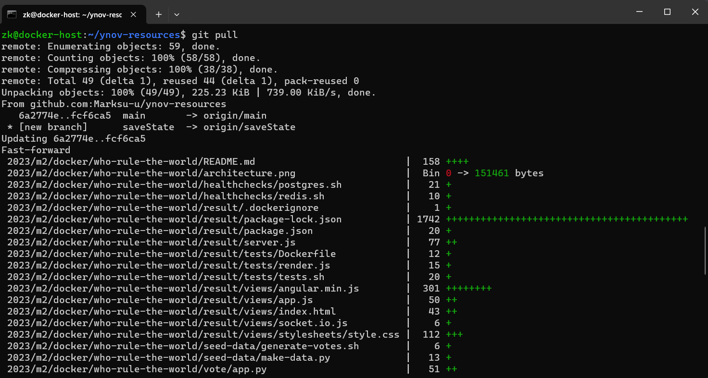
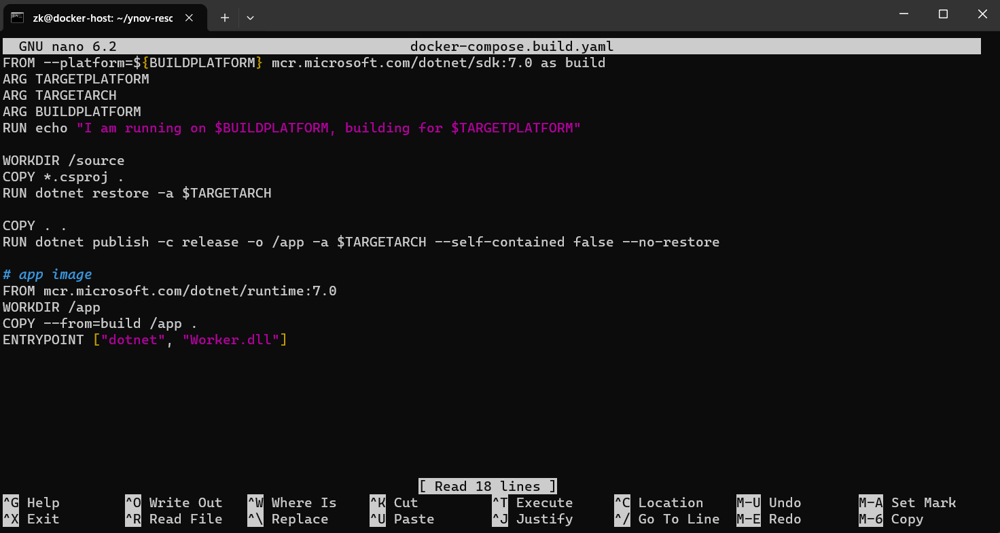
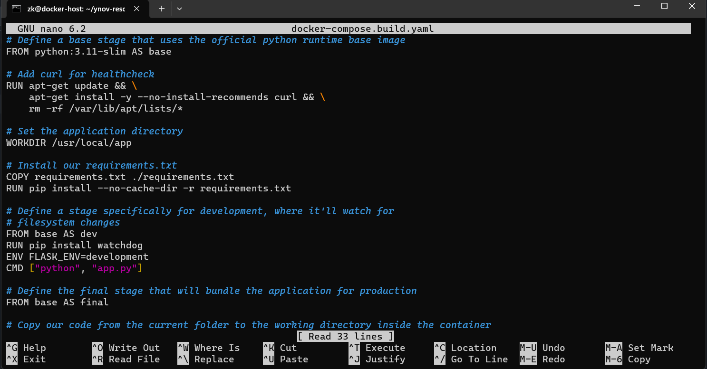
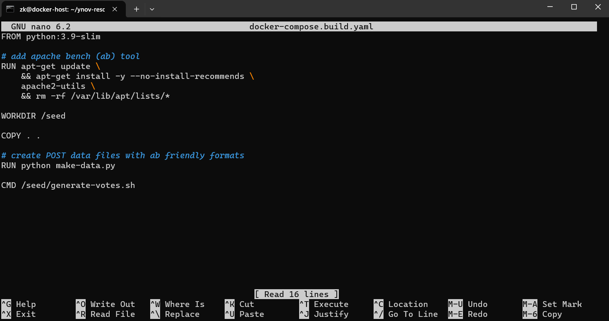
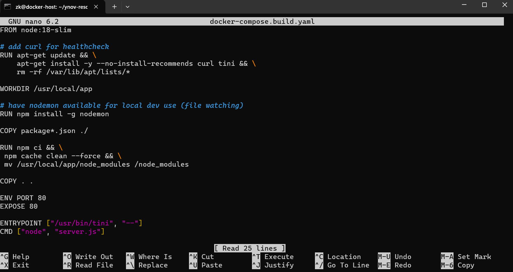
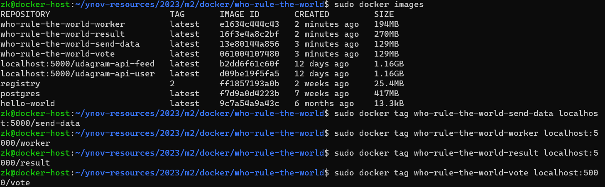
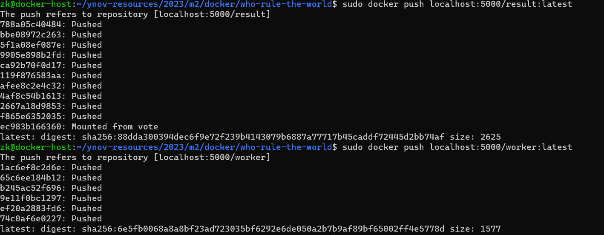
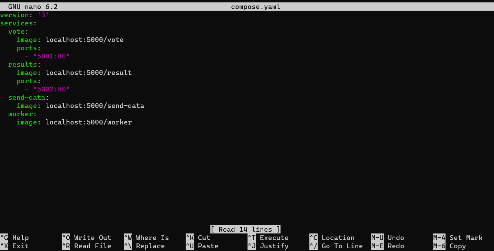
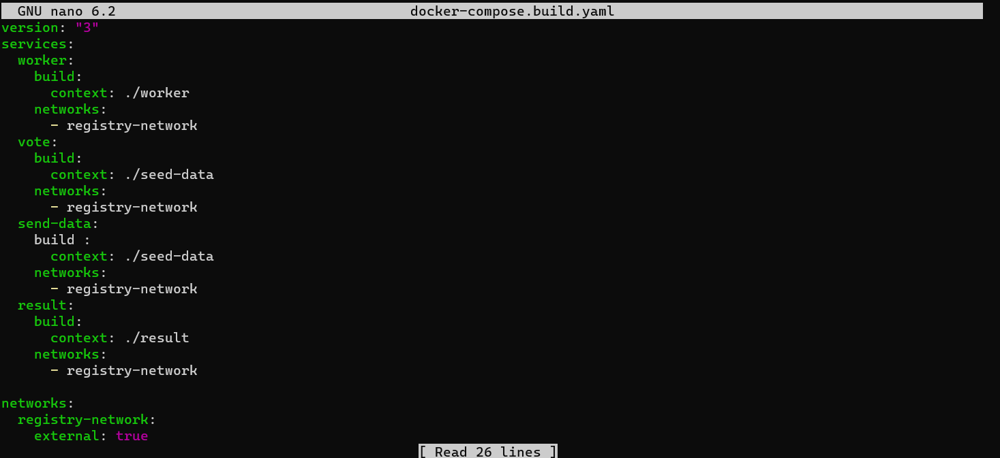
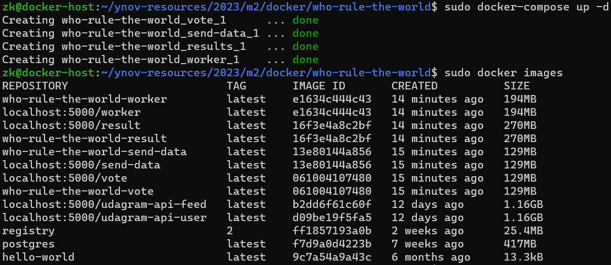

# Who Rule The World App - Submission

## Sommaires
1. [Project Team](#project-team)
2. [Start](#start)
3. [Building Images](#building-images)
    - [Worker Service](#worker-service)
    - [Vote Service](#vote-service)
    - [Seed Data](#seed-data)
    - [Result Service](#result-service)
4. [Tag & Push](#tag-et-push)
5. [Docker Compose](#docker-compose)

## Project Team

- Zakaria Amraoui
- Amir Jaafar
- Marc Gapasin

## Start

Dans un premier temps, nous avons récupéré le projet Who-Rule-The-World.

## Building Images

SUite à cela, il est nécéssaire de créer les fichiers docker-compose.build.yaml pour les différents services.

### Worker Service

Tout d'abord avec le Worker service.

---

### Vote Service</a>

Ensuite le Vote service.

---

### Seed Data Service

Suivi du Seed Data service.

---

### Result Service

Et enfin du Result Service.

## Tag et Push

Nous avons ensuite taggés toutes nos images sous le nom who-rule-the-world-imagename.

Puis nous les avons push dans notre registry.

## Docker Compose

Nous avons créé le ficher docker-compose.build.yaml à la racine projet.

Nous avons créé le ficher compose.yaml

Puis nous avons lancer la commande docker-compose à la racine du projet.

